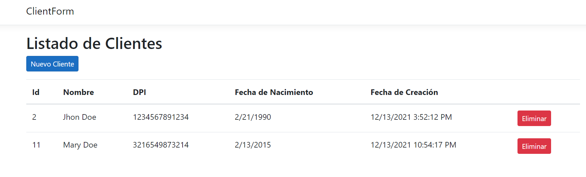

# Formulario de Usuarios

> Proyecto web creado usando .Net Core.



Esta aplicación permite la inserción de clientes, al inicio se muestra un listado de los clientes. La opción para agregar nuevos clientes se encuentra sobre la tabla de clientes del lado izquierdo.

## Creado Con

- C#,
- .Net Core 5.0,
- EntityFramework

## Inicio

Obten una copia clonando el proyecto con la instrucción: `git clone https://github.com/me-skit/ClientForm.git` para HTTPS o `git clone git@github.com:me-skit/ClientForm.git` usando SSH.

## Configuración de la Base de Datos

Creación de la base de datos:

```
CREATE DATABASE ClientsDB;
```

Creación de la tabla `CLIENT`

```
USE ClientsDB;

CREATE TABLE [Client](
	[Id] [int] IDENTITY(1,1) NOT NULL,
	[Name] [varchar](128) NOT NULL,
	[DPI] [nvarchar](13) NOT NULL,
	[BirthDate] [datetime],	
	[CreationDate] [datetime] NOT NULL,
 CONSTRAINT [PK_Clients] PRIMARY KEY CLUSTERED 
(
	[Id] ASC
)WITH (PAD_INDEX = OFF, STATISTICS_NORECOMPUTE = OFF, IGNORE_DUP_KEY = OFF, ALLOW_ROW_LOCKS = ON, ALLOW_PAGE_LOCKS = ON, OPTIMIZE_FOR_SEQUENTIAL_KEY = OFF) ON [PRIMARY]
) ON [PRIMARY]
```

Ingresa las credenciales correctas para un Usuario(User Id) y password en el archivo `appsettings.json` en el valor `ConnectionStrings` para la cadena `ApplicationDbContext`.

Ya puedes ejecutar el proyecto.

## Punto 3 - Eliminación de un cliente usando una función en JS

Para este punto se ha creado un controlador que provee de un método API para eliminar un cliente usando la URL `http://localhost:6552/controlador/eliminar/{id}` en el archivo `ServiceController`. La función en lenguaje JS se encuentra en el archivo `wwwroot/js/site.js`

## Punto 4 - Servicio API para crear un cliente

Utilizando el archivo `ServiceController` se a creado un servicio para la creación de clientes utilizando la siguente URL con el metodo POST:

```
https://localhost:44374/controlador/crear
```
El formato del archivo de Json que debe acompañar la URL para la creación de un cliente es el siguiente:

```
{
    "name": "Jhon Doe",
    "dpi": "1234567891203",
    "birthDate": "1990-01-01T12:53:00"
}
```

## Autor

👤 **Manuel**

- Github: [@meme_es](https://github.com/me-skit)
- Linkedin: [linkedin](https://www.linkedin.com/in/manuel-elias/)

## Show your support

Danos una ⭐️ si te gusta el proyecto!


## 📝 License

Este proyecto no tiene ningun tipo de licencia.
